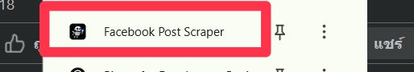
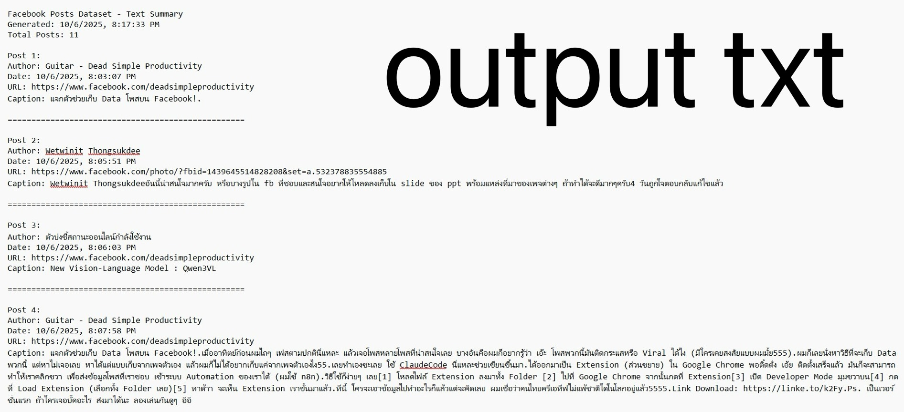
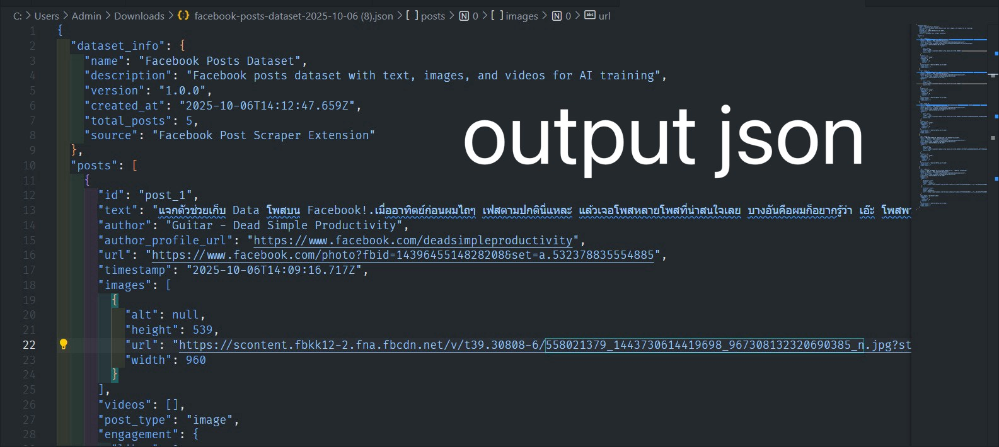
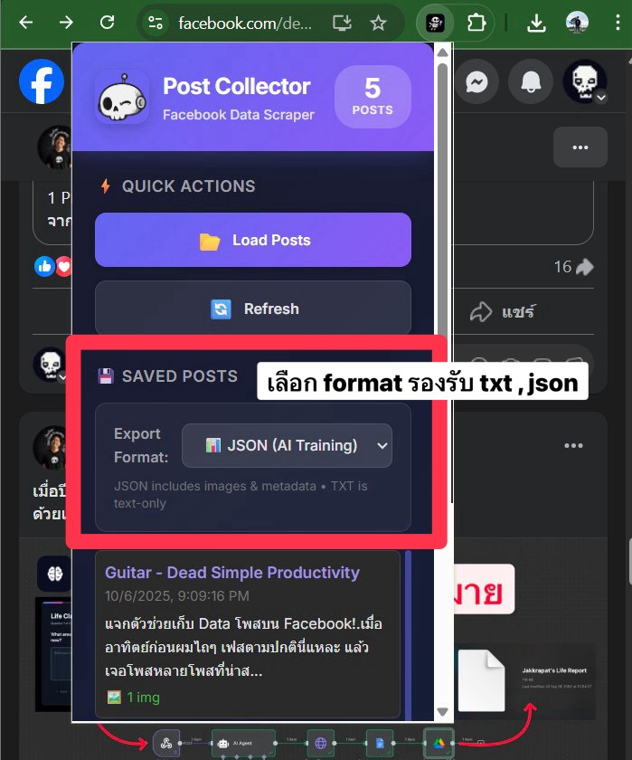
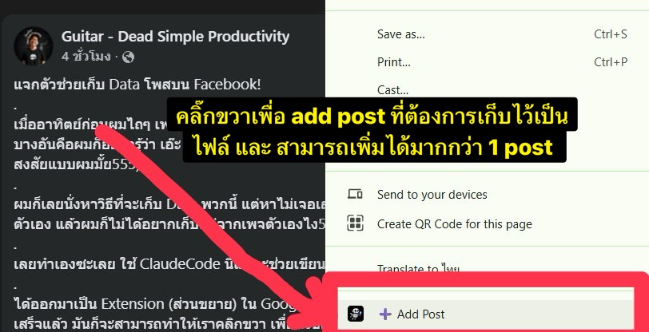
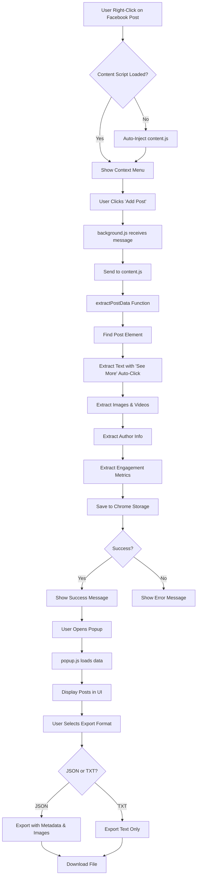

# Facebook Post Scraper

A Chrome extension for collecting Facebook posts with complete data extraction including text, images, videos, and engagement metrics. Perfect for AI training datasets, social media analysis, and content research.

**Developed by zombitx64**

---

## 🎬 Visual Workflow

```
┌─────────────────────────────────────────────────────────────────────┐
│                    FACEBOOK POST SCRAPER WORKFLOW                    │
└─────────────────────────────────────────────────────────────────────┘

   1️⃣ BROWSE FACEBOOK          2️⃣ ADD POST              3️⃣ VIEW DATA
   
   📱 Facebook Feed          ➕ Right-Click Menu        🎨 Modern Popup
   ┌──────────────┐         ┌──────────────┐          ┌──────────────┐
   │  📝 Post 1   │   →     │   Add Post   │    →     │ 📊 5 POSTS   │
   │  📝 Post 2   │  click  │  ⚡Extract   │  saved   │              │
   │  📝 Post 3   │         │   & Save     │          │  📂 Load     │
   └──────────────┘         └──────────────┘          │  🔄 Refresh  │
                                                       └──────────────┘
                                                              ↓
   
   4️⃣ SELECT FORMAT           5️⃣ EXPORT DATA
   
   📊 Choose Type            📥 Download File
   ┌──────────────┐         ┌──────────────────────┐
   │ ○ JSON       │         │ facebook-posts-      │
   │   (AI Train) │   →     │ dataset-2025-10-06   │
   │ ○ TXT        │  export │ .json / .txt         │
   │   (Readable) │         │                      │
   └──────────────┘         └──────────────────────┘
```

### 📸 Screenshots from Usage

#### **ขั้นตอนที่ 1: คลิกขวาที่โพสต์บน Facebook**



**คำอธิบาย:**
- เปิด Facebook และเลื่อนหาโพสต์ที่ต้องการเก็บข้อมูล
- **คลิกขวา** ที่โพสต์ (คลิกที่ไหนก็ได้บนโพสต์)
- จะเห็นเมนู context menu พร้อมตัวเลือก **"➕ Add Post"**
- Extension จะทำงานอัตโนมัติทันทีที่คลิก

---

#### **ขั้นตอนที่ 2: เปิด Popup และดูโพสต์ที่บันทึก**



**คำอธิบาย:**
- คลิกที่ไอคอน **Extension** ในแถบเครื่องมือ Chrome
- จะเห็นหน้าต่าง Popup ที่สวยงามพร้อม:
  - 📊 **Badge แสดงจำนวนโพสต์** (เช่น "5 POSTS")
  - ⚡ **Quick Actions**: ปุ่ม Load Posts และ Refresh
  - 🎨 **การออกแบบสไตล์ทันสมัย** พร้อม gradient สีม่วง

---

#### **ขั้นตอนที่ 3: เลือก Format การ Export**



**คำอธิบาย:**
- หลังจากกด **"Load Posts"** จะเห็นรายการโพสต์ที่บันทึกไว้
- เลือก **Export Format** จาก dropdown:
  - 📊 **JSON (AI Training)** - ข้อมูลครบถ้วนพร้อม metadata และรูปภาพ
  - 📝 **TXT (Readable)** - เฉพาะข้อความ อ่านง่าย
- ด้านล่างจะมีคำแนะนำว่าแต่ละ format เหมาะสำหรับอะไร

---

#### **ขั้นตอนที่ 4: Export ข้อมูลและดาวน์โหลด**


**คำอธิบาย:**
- กด **"📥 Export Data"** (ปุ่มสีเขียว) เพื่อดาวน์โหลดไฟล์
- ตัวเลือกเพิ่มเติม:
  - **🖼️ Download Images** - ดาวน์โหลดรูปภาพแยกต่างหาก
  - **🗑️ Clear All** - ลบโพสต์ทั้งหมด (ระวัง!)
- ไฟล์จะดาวน์โหลดอัตโนมัติพร้อมชื่อไฟล์ที่มีวันที่

---

#### **ขั้นตอนที่ 5: ดูผลลัพธ์ JSON Output**



**คำอธิบาย:**
- ไฟล์ JSON ที่ได้จะมีโครงสร้างข้อมูลครบถ้วน:
  - ✅ `dataset_info` - ข้อมูล metadata ของ dataset
  - ✅ `posts` - Array ของโพสต์ทั้งหมด
  - ✅ แต่ละโพสต์มี: text, author, images, videos, engagement
  - ✅ รองรับ **UTF-8 encoding** สำหรับภาษาไทย
- เหมาะสำหรับ **AI/ML training** และ **data analysis**

---

#### **ขั้นตอนที่ 6: ดูผลลัพธ์ TXT Output**



**คำอธิบาย:**
- ไฟล์ TXT จะแสดงข้อมูลในรูปแบบที่อ่านง่าย:
  - 📝 Header พร้อมจำนวนโพสต์ทั้งหมด
  - 👤 Author name และ URL
  - 📅 วันที่และเวลา
  - 💬 Caption เต็มรูปแบบ
  - `=====` เส้นแบ่งระหว่างโพสต์
- เหมาะสำหรับ **การตรวจสอบ** และ **อ่านเนื้อหา**

---

### 🎯 ตัวอย่างการใช้งานจริง

## ✨ Features

- 🎯 **Single-Click Extraction** - Right-click "Add Post" to save any Facebook post
- � **Complete Text Capture** - Automatically expands "See More" to get full captions (supports multi-paragraph posts)
- �️ **Media Collection** - Extracts all images and videos with URLs
- 📊 **Engagement Metrics** - Captures likes, comments, and shares (with debugging support)
- 💾 **Local Storage** - Saves up to 500 posts locally in Chrome storage
- 📥 **Export Capabilities** - Export to JSON or TXT format with metadata
- 🌐 **Multi-language** - Supports English and Thai Facebook interfaces
- 🔄 **No Duplicates** - Currently disabled - adds ALL posts without duplicate checking
- 🎨 **UTF-8 Support** - Proper Thai language encoding

## 🚀 Installation

### From Source

1. Download or clone this repository
2. Open Chrome and go to `chrome://extensions`
3. Enable "Developer mode" (toggle in top right)
4. Click "Load unpacked"
5. Select the extension folder
6. The extension is now ready to use!

## 📖 Usage

### 🔄 Complete Workflow

```
Step 1: Browse Facebook     Step 2: Add Post        Step 3: View & Export
     ↓                           ↓                         ↓
┌──────────┐             ┌──────────┐              ┌──────────┐
│ Facebook │  →  Right-  │   Add    │  →  Saved   │  Export  │
│   Post   │     Click   │   Post   │     Posts   │   Data   │
└──────────┘             └──────────┘              └──────────┘
     │                                                   │
     └─────────────── Repeat for more posts ────────────┘
```

### 📝 Step-by-Step Guide

#### **Step 1: เพิ่มโพสต์ (Add Post)**

1. เปิด Facebook และเลื่อนหาโพสต์ที่ต้องการเก็บ
2. **คลิกขวาที่โพสต์** (คลิกที่ไหนก็ได้บนโพสต์)
3. เลือก **"➕ Add Post"** จากเมนู
4. Extension จะทำงานอัตโนมัติ:
   - ✅ ดึงข้อความทั้งหมด (คลิก "See More" อัตโนมัติ)
   - ✅ ดึง URL รูปภาพและวิดีโอทั้งหมด
   - ✅ บันทึกข้อมูล author, timestamp, engagement
   - ✅ เก็บไว้ใน Chrome Storage

> **💡 Tips:** 
> - สามารถเพิ่มได้ทุกโพสเลย ไม่จำกัดจำนวน (ปิดระบบตรวจสอบซ้ำแล้ว)
> - Extension จะ auto-inject ถ้ายังไม่ได้โหลด
> - รองรับทั้งภาษาไทยและอังกฤษ

#### **Step 2: ดูโพสต์ที่บันทึก (View Saved Posts)**

1. คลิกที่ไอคอน Extension ในแถบเครื่องมือ Chrome
2. คลิก **"📂 Load Posts"** เพื่อดูโพสต์ทั้งหมด
3. จะเห็น:
   - 📊 **จำนวนโพสต์** ที่เก็บไว้ (แสดงในแบดจ์ด้านบน)
   - 📝 **รายการโพสต์** พร้อมตัวอย่างข้อความ
   - 🎨 **การ์ดแสดงผล** ที่สวยงามและอ่านง่าย

#### **Step 3: เลือก Format การ Export**

มี 2 รูปแบบให้เลือก:

**📊 JSON (AI Training)**
- ✅ ข้อมูลครบถ้วนพร้อม metadata
- ✅ มี URL รูปภาพและวิดีโอ
- ✅ เหมาะสำหรับ AI/ML training
- ✅ รูปแบบ structured data

**📝 TXT (Human Readable)**
- ✅ เฉพาะข้อความ อ่านง่าย
- ✅ เหมาะสำหรับการตรวจสอบ
- ✅ แยกแต่ละโพสต์ด้วยเส้นแบ่ง

#### **Step 4: Export ข้อมูล**

1. เลือก format จาก dropdown: **JSON** หรือ **TXT**
2. คลิกปุ่ม **"📥 Export Data"** (สีเขียว)
3. ไฟล์จะดาวน์โหลดอัตโนมัติ:
   - `facebook-posts-dataset-[วันที่].json`
   - หรือ `facebook-posts-[วันที่].txt`

**Options เพิ่มเติม:**
- **🖼️ Download Images** - ดาวน์โหลดรูปภาพแยกต่างหาก
- **🗑️ Clear All** - ลบโพสต์ทั้งหมด (ระวัง! ไม่สามารถกู้คืนได้)

### 🎯 Use Cases

**สำหรับ AI/ML Training:**
```json
{
  "dataset_info": {
    "name": "Facebook Posts Dataset",
    "total_posts": 11,
    "source": "Facebook Post Scraper Extension"
  },
  "posts": [
    {
      "id": "post_1",
      "text": "...",
      "images": [...],
      "engagement": {...}
    }
  ]
}
```

**สำหรับ Content Analysis:**
```txt
Post 1:
Author: Guitar - Dead Simple Productivity
Date: 10/6/2025, 8:03:07 PM
Caption: แจกตัวช่วยเก็บ Data โพสต์บน Facebook!...
=============================================
```

### ⚡ Quick Actions Panel

หลังจากกด "Load Posts" จะเห็นปุ่มต่างๆ:

- **📂 Load Posts** - โหลดโพสต์ที่บันทึกไว้
- **🔄 Refresh** - รีเฟรชรายการ
- **� Export Data** - Export เป็น JSON/TXT
- **🖼️ Download Images** - ดาวน์โหลดรูปภาพ
- **🗑️ Clear All** - ลบข้อมูลทั้งหมด

### Data Structure

Each post includes:
- `id` - Unique post identifier
- `text` - Complete caption/post text
- `author` - Author name and profile URL
- `url` - Link to the post
- `timestamp` - When the post was extracted
- `images[]` - Array of image URLs with dimensions
- `videos[]` - Array of video URLs
- `post_type` - Type classification (text, image, video, etc.)
- `engagement` - Likes, comments, shares counts
- `image_count`, `video_count` - Media counts

## ⚙️ How It Works

### 🎯 1. Extension Auto-Injection System

```javascript
// Ping-Pong Mechanism
async function ensureContentScriptAndSend(tabId, message) {
  // 1. ส่งสัญญาณ ping ไปที่ content script
  const response = await chrome.tabs.sendMessage(tabId, { action: 'ping' });
  
  if (response?.status === 'ready') {
    // 2. ถ้า content script โหลดแล้ว → ส่งข้อมูลเลย
    chrome.tabs.sendMessage(tabId, message);
  } else {
    // 3. ถ้ายังไม่โหลด → inject script ก่อน
    await chrome.scripting.executeScript({
      target: { tabId },
      files: ['src/js/content.js']
    });
    // 4. จากนั้นค่อยส่งข้อมูล
    chrome.tabs.sendMessage(tabId, message);
  }
}
```

**ทำไมต้องมี?**
- ป้องกัน "Could not establish connection" error
- ตรวจสอบว่า content script โหลดแล้วหรือยัง
- Auto-inject ถ้ายังไม่มี → ไม่ต้องรีโหลดหน้าเอง

### 📝 2. Text Extraction Strategy

```javascript
// Multi-Strategy Text Extraction
async function extractTextFromPost(postElement) {
  // Strategy 1: Auto-click "See More" (3 attempts)
  for (let i = 0; i < 3; i++) {
    const seeMore = postElement.querySelector('[role="button"]');
    if (seeMore?.textContent.includes('See more')) {
      seeMore.click();
      await delay(200); // รอให้ข้อความขยาย
    }
  }
  
  // Strategy 2: Find text containers
  const selectors = [
    '[data-ad-preview="message"]',
    '[data-ad-comet-preview="message"]',
    '.userContent',
    '[dir="auto"]'
  ];
  
  // Strategy 3: Get longest text
  let maxText = '';
  for (const selector of selectors) {
    const text = postElement.querySelector(selector)?.innerText || '';
    if (text.length > maxText.length) maxText = text;
  }
  
  return maxText;
}
```

**Features:**
- ✅ คลิก "ดูเพิ่มเติม" อัตโนมัติ (3 ครั้ง, delay 200ms)
- ✅ หา selector หลายแบบ
- ✅ เลือกข้อความที่ยาวที่สุด
- ✅ รองรับ Thai/English

### 🖼️ 3. Media Extraction

```javascript
// Image Extraction
const images = Array.from(postElement.querySelectorAll('img'))
  .filter(img => img.src && !img.src.includes('emoji'))
  .map(img => ({
    url: img.src,
    alt: img.alt || null,
    width: img.naturalWidth || img.width,
    height: img.naturalHeight || img.height
  }));

// Video Extraction  
const videos = Array.from(postElement.querySelectorAll('video'))
  .map(video => ({
    url: video.src || video.querySelector('source')?.src,
    type: 'video'
  }));
```

**What's Extracted:**
- 🖼️ รูปภาพ: URL, ขนาด, alt text
- 🎥 วิดีโอ: URL, source
- ❌ กรอง: emoji, ไอคอนเล็กๆ

### 📊 4. Engagement Metrics (Debugging)

```javascript
// Engagement Extraction with Debug Logging
const ariaElements = postElement.querySelectorAll('[aria-label]');
for (const element of ariaElements) {
  const label = element.getAttribute('aria-label').toLowerCase();
  
  console.log('🔍 Found aria-label:', label); // Debug
  
  // Pattern matching
  if (label.includes('like')) {
    engagement.likes = extractNumber(label);
  }
  if (label.includes('comment')) {
    engagement.comments = extractNumber(label);
  }
  if (label.includes('share')) {
    engagement.shares = extractNumber(label);
  }
}
```

**Current Status:**
- ⚠️ Known Issue: แสดง 0 บางครั้ง
- 🔍 Debug logging เปิดอยู่
- 📝 ต้องการข้อมูล aria-label patterns จริง

### 💾 5. Storage Management

```javascript
// Save to Chrome Storage
chrome.storage.local.get(['posts'], async (result) => {
  let posts = result.posts || [];
  
  // No duplicate check (disabled)
  posts.unshift({
    id: `post_${Date.now()}`,
    ...postData,
    timestamp: new Date().toISOString()
  });
  
  // Limit: 500 posts
  if (posts.length > 500) {
    posts = posts.slice(0, 500);
  }
  
  await chrome.storage.local.set({ posts });
});
```

**Storage Limits:**
- 📦 Max: 500 posts
- 💾 Size: ~5MB (Chrome limit)
- 🔄 No duplicate check (ตามที่ user ต้องการ)

### 📥 6. Export Functions

```javascript
// JSON Export
function exportJSON(posts) {
  const dataset = {
    dataset_info: {
      name: "Facebook Posts Dataset",
      version: "1.0.0",
      created_at: new Date().toISOString(),
      total_posts: posts.length,
      source: "Facebook Post Scraper Extension"
    },
    posts: posts
  };
  
  const blob = new Blob([JSON.stringify(dataset, null, 2)], {
    type: 'application/json;charset=utf-8'
  });
  downloadFile(blob, `facebook-posts-dataset-${getDateString()}.json`);
}

// TXT Export
function exportTXT(posts) {
  let content = `Facebook Posts Dataset - Text Summary\n`;
  content += `Generated: ${new Date().toLocaleString()}\n`;
  content += `Total Posts: ${posts.length}\n\n`;
  
  posts.forEach((post, i) => {
    content += `Post ${i + 1}:\n`;
    content += `Author: ${post.author}\n`;
    content += `Date: ${post.timestamp}\n`;
    content += `Caption: ${post.text}\n`;
    content += `${'='.repeat(50)}\n\n`;
  });
  
  const blob = new Blob([content], {
    type: 'text/plain;charset=utf-8'
  });
  downloadFile(blob, `facebook-posts-${getDateString()}.txt`);
}
```

**Export Features:**
- 📊 JSON: Complete metadata + images
- 📝 TXT: Text-only readable format
- 🔤 UTF-8 encoding (Thai support)
- 📅 Auto filename with date

## 📋 Data Format

### JSON Export Example

```json
{
  "dataset_info": {
    "name": "Facebook Posts Dataset",
    "description": "Facebook posts dataset with text, images, and videos for AI training",
    "version": "1.0.0",
    "created_at": "2025-10-06T13:08:27.700Z",
    "total_posts": 9,
    "source": "Facebook Post Scraper Extension"
  },
  "posts": [
    {
      "id": "post_1",
      "text": "Complete post caption...",
      "author": "Author Name",
      "author_profile_url": "https://www.facebook.com/username",
      "url": "https://www.facebook.com/...",
      "timestamp": "2025-10-06T13:03:07.073Z",
      "images": [
        {
          "url": "https://...",
          "alt": null,
          "width": 590,
          "height": 331
        }
      ],
      "videos": [],
      "post_type": "image",
      "engagement": {
        "likes": 0,
        "comments": 0,
        "shares": 0
      },
      "extracted_at": "2025-10-06T13:08:27.700Z",
      "image_count": 1,
      "video_count": 0
    }
  ]
}
```

## 🔧 Troubleshooting

### Extension Not Working
1. **Reload the extension**: Go to `chrome://extensions` → Click reload (🔄)
2. **Reload Facebook tab**: Press `Ctrl+R` or `F5` on the Facebook page
3. **Check Console**: Press `F12` to see error messages

### "Could not establish connection" Error
- The extension auto-injects content script if needed
- If error persists, try:
  1. Close and reopen Facebook tab
  2. Remove and reinstall extension
  3. Clear browser cache

### Engagement Showing 0
- **Current Known Issue**: Engagement extraction needs debugging
- Enable Console (F12) and look for:
  ```
  🔍 Found X aria-labels in post
  ✅ Likes: XX (from aria-label: "...")
  ```
- Please report the aria-label formats you see

### Caption Not Complete
- Make sure to scroll to the post before right-clicking
- Extension auto-clicks "See More" up to 3 times
- For very long posts, try scrolling down first

## 🛠️ Development

### 🔧 Technical Workflow



### 📊 Data Flow Architecture

```
┌─────────────────────────────────────────────────────────────┐
│                      CHROME EXTENSION                        │
├─────────────────────────────────────────────────────────────┤
│                                                               │
│  ┌──────────────┐      ┌──────────────┐      ┌───────────┐ │
│  │ background.js│◄────►│  content.js  │◄────►│ Facebook  │ │
│  │   (Service   │      │ (Extraction) │      │    DOM    │ │
│  │    Worker)   │      └──────────────┘      └───────────┘ │
│  └──────┬───────┘              │                             │
│         │                      │                             │
│         │        ┌─────────────▼─────────────┐              │
│         │        │   Chrome Storage API       │              │
│         │        │  (Max 500 posts, 5MB)      │              │
│         │        └─────────────┬─────────────┘              │
│         │                      │                             │
│  ┌──────▼───────┐      ┌───────▼───────┐                    │
│  │  popup.js    │◄────►│  popup.html   │                    │
│  │  (UI Logic)  │      │  (Interface)  │                    │
│  └──────────────┘      └───────────────┘                    │
│         │                                                     │
│         ▼                                                     │
│  ┌─────────────────────────────┐                            │
│  │  Export: JSON / TXT / Images│                            │
│  └─────────────────────────────┘                            │
└─────────────────────────────────────────────────────────────┘
```

### 🔄 Message Passing System

```javascript
// 1. User Right-Clicks → background.js
chrome.contextMenus.onClicked.addListener((info, tab) => {
  chrome.tabs.sendMessage(tab.id, { action: "extractPost" });
});

// 2. background.js → content.js
chrome.runtime.onMessage.addListener((request, sender, sendResponse) => {
  if (request.action === "extractPost") {
    extractPostData(request.coordinates);
  }
});

// 3. content.js → Chrome Storage
chrome.storage.local.set({ posts: allPosts });

// 4. popup.js ← Chrome Storage
chrome.storage.local.get(['posts'], (result) => {
  displayPosts(result.posts);
});
```

### Project Structure

```
facebook-post-scraper/
├── manifest.json              # Extension configuration (Manifest V3)
├── src/
│   ├── js/
│   │   ├── background.js      # Service worker, context menu
│   │   ├── content.js         # DOM extraction, auto-injection
│   │   └── popup.js           # UI logic, export functions
│   ├── html/
│   │   └── popup.html         # Modern popup interface
│   └── css/
│       └── popup.css          # Gradient design, Inter font
├── image/
│   ├── dsp_wink.png          # Logo
│   ├── icon16.png            # Extension icons
│   ├── icon48.png
│   └── icon128.png
├── README.md                  # Documentation
├── CHANGELOG.md              # Version history
└── RELEASES.md               # Release notes
```

### Key Technologies

**Chrome Extension APIs:**
- **Manifest V3** - Latest Chrome extension format
- **Content Scripts** - Injected into Facebook pages
- **Background Service Worker** - Event-based architecture
- **Chrome Storage API** - Local data persistence (5MB limit)
- **Context Menus API** - Right-click menu integration
- **Scripting API** - Dynamic script injection

**JavaScript Features:**
- **Async/Await** - Modern async patterns
- **DOM Manipulation** - Element extraction
- **Message Passing** - Cross-context communication
- **UTF-8 Encoding** - Thai language support

## 📝 Known Issues

1. **Engagement Metrics** - Currently showing 0 (debugging in progress)
   - Need to identify correct Facebook DOM structure
   - Debug logging added to help identify patterns

2. **Duplicate Detection** - Currently disabled
   - All posts can be added without restriction
   - May result in duplicate entries if same post added multiple times

## 🚀 Roadmap

- [ ] Fix engagement metrics extraction
- [ ] Add filtering options in popup
- [ ] Implement search functionality
- [ ] Add batch export capabilities
- [ ] Support for Facebook Stories
- [ ] Comment thread extraction
- [ ] Re-enable smart duplicate detection

## 📄 License

This project is open source and available under the MIT License.

## 🤝 Contributing

Contributions are welcome! Please feel free to submit issues or pull requests.

## ⚠️ Disclaimer

This tool is for personal use and research purposes only. Please respect Facebook's Terms of Service and privacy policies. Do not use this tool to scrape private content or violate anyone's privacy.

## 📧 Support

If you encounter any issues or have questions:
1. Check the Console (F12) for error messages
2. Open an issue on GitHub
3. Include Console logs and screenshots if possible

---

**Version**: 1.0.0  
**Last Updated**: October 6, 2025

**Solution:**
- Make sure you've clicked into the full post (not viewing from feed)
- If in photo viewer, close it first or click "See post"
- Try using text selection mode instead

### Popup Shows Errors

**Solution:**
- Reload the extension: Go to `chrome://extensions` and click the reload icon
- Clear the errors by clicking "Clear all" in the Errors page

### Caption Contains Comments Instead of Post Text

**Solution:**
- Use **text selection mode** - highlight the actual caption text before right-clicking
- Make sure you're in full post view (not photo modal)

### Extension Not Appearing

**Solution:**
- Check that you're on `facebook.com` (extension only works on Facebook)
- Reload the Facebook page
- Check extension is enabled in `chrome://extensions`

## Development

### Project Structure

The codebase is organized into logical folders for better maintainability:

- **`src/css/`** - All CSS stylesheets (popup.css, design-guideline.css)
- **`src/html/`** - HTML templates and UI files
- **`src/js/`** - JavaScript logic files (background.js, content.js, popup.js)
- **`docs/`** - Documentation and development guides

### File Structure

```
dsp-scraper/
├── manifest.json          # Extension configuration
├── src/
│   ├── css/
│   │   ├── popup.css              # Popup UI styles
│   │   └── design-guideline.css   # Design guideline styles
│   ├── html/
│   │   ├── popup.html             # Extension popup UI
│   │   └── design-guideline.html  # UI/UX specifications
│   └── js/
│       ├── background.js          # Service worker for context menu
│       ├── content.js             # Main extraction logic
│       └── popup.js               # Popup logic
├── DEVELOPMENT.md        # Detailed development guide
├── PROGRESS.md           # Feature tracking
├── ERROR_LOG.md          # Error tracking and solutions
└── icons/                # Extension icons
```

### For Developers

See [DEVELOPMENT.md](DEVELOPMENT.md) for:
- Architecture overview
- Technical implementation details
- Debugging guide
- Adding new features
- Common issues and solutions

## Changelog

### Latest Updates (2025)

- 🎥 **Video Support** - Extract Facebook videos, reels, and external video links
- 📁 **Code Organization** - Reorganized codebase with dedicated CSS, HTML, and JS folders
- 📊 **Enhanced Export** - Improved JSON export with video metadata for AI training
- 🔄 **Duplicate Prevention** - Advanced duplicate detection for video posts
- 🎨 **Modular CSS** - Separated inline styles into dedicated CSS files

### Version 1.0

- ✅ Text selection for 100% accurate caption extraction
- ✅ Auto-detection in full post view
- ✅ "See more" auto-click for full captions
- ✅ Photo modal detection with helpful guidance
- ✅ Multi-language support (English/Thai)
- ✅ Complete engagement stats extraction
- ✅ Clean, simple popup UI

## Contributing

Contributions are welcome! Please feel free to submit issues or pull requests.

## License

MIT License - See [LICENSE](LICENSE) file for details

## Support

If you encounter any issues or have questions:
1. Check the [Troubleshooting](#troubleshooting) section
2. Review [ERROR_LOG.md](ERROR_LOG.md) for known issues and solutions
3. Open an issue on GitHub

## Acknowledgments

Built with ❤️ for automating Facebook data collection workflows.

**Developer:** zombitx64
